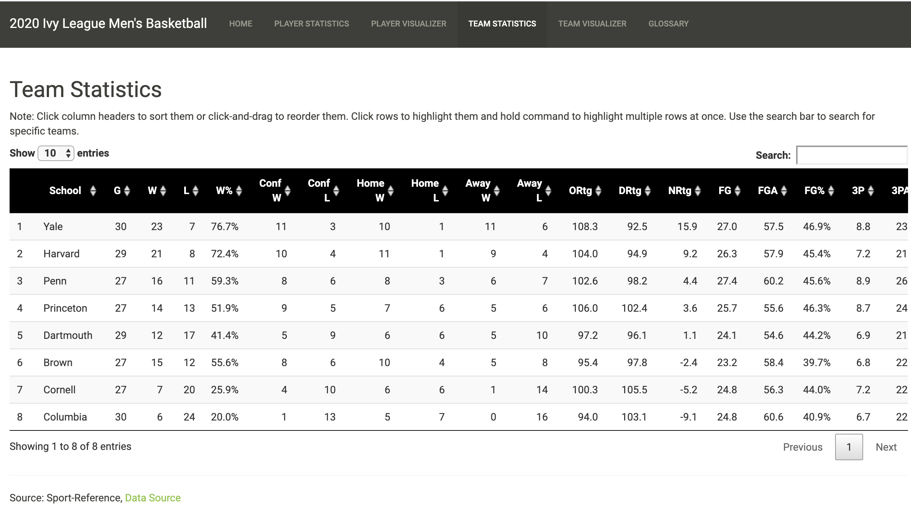

# Visualizing the 2020 Ivy League Men’s Basketball Regular Season

Last update: May 8, 2020

[App Website Link](https://sbilliau.shinyapps.io/ivy_mbb2020/)

2020 Ivy League Men’s Basketball statistics with visualizations for easy
comparison. Written in RShiny.

## HomePage

## Player Statistics

## Player Visualizer

## Team Statistics

## Team Visualizer

## Glossary

## Data Source:

Sport-Reference,
[Link](https://www.sports-reference.com/cbb/conferences/ivy/2020.html)
